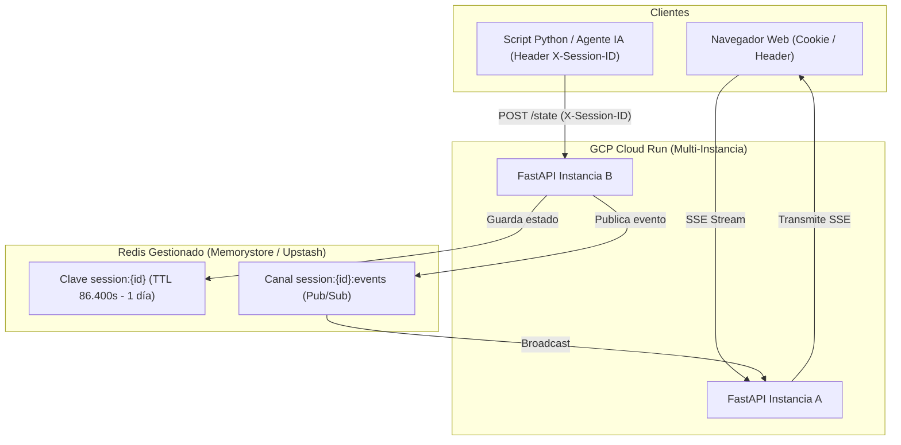

# ADR 0004: Persistencia en Redis, Aislamiento de Sesiones por Dispositivo sin Login y Despliegue en GCP Cloud Run

## Estado

**Aceptado** (2026-08)

## Contexto

TributIA fue concebida inicialmente como una aplicación de cálculo tributario y sincronización reactiva local con almacenamiento de sesión en memoria volátil de proceso (`InMemorySessionStore`).

Al planear el despliegue a producción en **Google Cloud Platform (GCP) Cloud Run**, surgieron los siguientes requerimientos y limitaciones técnicas:
1. **Escalamiento horizontal y Scale-to-Zero**: Cloud Run crea y destruye instancias de contenedores de forma dinámica según el tráfico. La memoria de proceso no se comparte entre réplicas ni sobrevive a reinicios.
2. **Server-Sent Events (SSE) Multi-Instancia**: Un usuario conectado por SSE a la Instancia A no recibiría mutaciones enviadas a la Instancia B si la sincronización no dispone de un bus de eventos distribuido.
3. **Cero Fricción / Cero Login**: El usuario no debe registrarse, recordar contraseñas ni pasar por flujos OAuth, pero cada usuario debe trabajar en su propia sesión aislada sin interferir con otros.
4. **Resiliencia ante pérdidas accidentales**: Si el usuario recarga la página o cierra el navegador, no debe perder su trabajo reciente.
5. **Control de Memoria**: Las sesiones abandonadas no deben saturar la base de datos indefinidamente.

## Decisión

Adoptamos una **Arquitectura de Persistencia Distribuida en Redis y Sesiones Criptográficas por Dispositivo (Zero-Login)**:

### Principios de la Decisión

1. **Redis como Motor de Sesión Central**:
   - Clave: `session:{session_id}` con serialización JSON de `SessionState` y `revision: int`.
   - **TTL de 1 Día (`86.400 segundos`) con Rolling Renewal**: Cada lectura o escritura renueva el tiempo de vida por otras 24 horas. Sesiones inactivas expiran automáticamente.
   - **Redis Pub/Sub**: Las mutaciones se publican en `session:{session_id}:events`. Cada réplica de Cloud Run con un stream SSE abierto escucha el canal de su cliente y retransmite los eventos en vivo.
2. **Aislamiento de Sesión Dual-Mode (Header HTTP + Cookie Criptográfica)**:
   - **Para Navegadores**: Auto-emisión de cookie segura `fiscol_sid` con UUIDv4 (`ses_...`) de 128 bits de entropía. Imposible de adivinar por fuerza bruta.
   - **Para APIs / Scripts / Agentes IA**: Cabecera estándar `X-Session-ID: <session_id>` para dirigir mutaciones a la sesión deseada.
3. **Resiliencia de UX (Client-Side)**:
   - Respaldo continuo en `localStorage['fiscol_draft_' + sessionId]`.
   - Modal de confirmación para acciones destructivas (Importar JSON / Limpiar formulario) cuando existen datos activos.
4. **Fallback Transparente en Memoria**:
   - Si no se configura `REDIS_URL`, la aplicación conmuta automáticamente a `InMemorySessionStore` para desarrollo local y ejecución ultra-rápida de pruebas unitarias (`pytest`).

## Consecuencias

### Positivas

- **Alta Disponibilidad en Cloud Run**: Contenedores 100% stateless capaces de escalar de 0 a N réplicas sin perder sesiones de usuario.
- **Rendimiento Sub-Milisegundo**: Lecturas y escrituras atómicas en memoria RAM con Redis.
- **Cero Fricción**: El usuario abre la URL y comienza a liquidar de inmediato; su sesión queda aislada de manera transparente.
- **Interoperabilidad Total con Agentes**: Los agentes IA pueden inyectar datos en tiempo real mediante la cabecera `X-Session-ID`.

### Negativas / Mitigaciones

- **Dependencia de Redis en Producción**: Requiere una instancia de Redis (GCP Cloud Memorystore o servicio gestionado).
  *Mitigación*: Fallback automático a `InMemorySessionStore` en entornos locales y testing.
