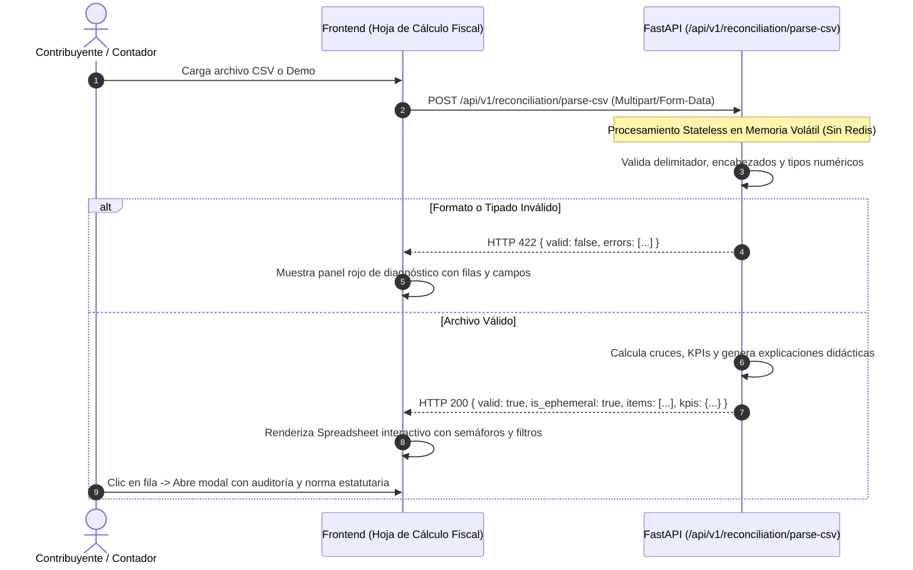

# ADR 0005: Visualizador Efímero de Conciliación Exógena y Transacciones CSV sin Persistencia

- **Estado**: **Aceptado**
- **Fecha**: 2026-08-18
- **Autores**: Equipo de Arquitectura e Ingeniería TributIA

---

## 1. Contexto y Problema

Los contribuyentes y contadores en Colombia necesitan conciliar sus certificados tributarios privados (Formularios 220 de ingresos y retenciones, extractos bancarios, certificados de vivienda y medicina prepagada) contra la Información Exógena reportada por terceros a la DIAN.

Sin embargo, los extractos y archivos de transacciones contienen datos financieros sensibles. Guardar permanentemente archivos CSV de transacciones bancarias o laborales en bases de datos o en la sesión de Redis representaría un riesgo innecesario de almacenamiento y violaría el principio de mínima retención de datos fiscales.

---

## 2. Decisión Arquitectónica

Se adopta un **modelo de procesamiento 100% efímero y stateless**:

1. **Cero Persistencia**:
   - El archivo CSV **NO se guarda en Redis ni en disco ni en base de datos**.
   - Los datos se procesan y validan al vuelo en la memoria volátil del servidor o se analizan en la memoria local del navegador del usuario.
   - Al refrescar o reiniciar la pestaña, los datos del CSV se descartan automáticamente.

2. **Validación Exhaustiva de Tipos y Delimitadores**:
   - Detección automática de delimitadores (`,`, `;`, `\t`).
   - Validación estricta de encabezados obligatorios y tipos de datos (números flotantes, fechas, enumeraciones de cédulas).
   - En caso de errores, se retorna un informe de diagnóstico detallado señalando fila, columna, valor recibido y causa del error.

3. **Auditoría Didáctica por Fila**:
   - Cada transacción incluye metadatos explicativos sobre cómo se alimenta la casilla correspondiente del Formulario 210 de la DIAN y la justificación legal de las diferencias (Art. 103, 119, 387 del Estatuto Tributario).

4. **Semaforización Visual**:
   - 🟢 `MATCH_EXACTO`: Coincidencia 100% con reporte exógena DIAN.
   - 🟡 `SOLO_EN_CERTIFICADOS` / `DIFERENCIA_JUSTIFICADA`: Deducciones legales imputables soportadas en certificados privados.
   - 🔴 `DISCREPANCIA_ALERTA`: Diferencias numéricas o falta de reporte que requieren revisión contable.

---

## 3. Diagrama de Flujo

---

## 4. Consecuencias

### Positivas

- **Máxima Privacidad**: Garantía absoluta de que la información financiera de transacciones no queda persistida en servidores de terceros.
- **Transparencia y Pedagogía Fiscal**: El usuario comprende exactamente el porqué de cada cifra en su Formulario 210.
- **Resiliencia Operativa**: Diagnóstico claro de errores en archivos CSV sin fallos opacos.

### Consideraciones

- Si el usuario recarga el navegador, debe volver a cargar su archivo CSV o presionar *Cargar Ejemplo*. Esta característica está claramente señalizada en la interfaz mediante el banner informativo de privacidad.
