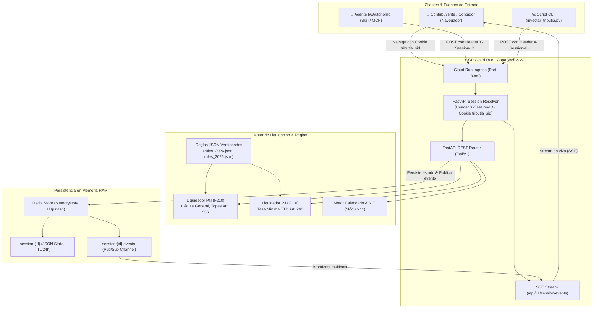

# Explicación: Arquitectura del Sistema TributIA

Este documento expone la filosofía de diseño, principios de ingeniería y decisiones técnicas fundamentales detrás de la plataforma **TributIA**.

---

## 1. Principios de Diseño

1. **Motor Tributario Desacoplado & Agnóstico**:
   La lógica de liquidación (`liquidacion_pn.py`, `liquidacion_pj.py`) no depende de frameworks web ni de bases de datos. Recibe modelos de dominio inmutables Pydantic y catálogos de reglas en memoria, lo que permite ejecutar cálculos a velocidad nativa en APIs, terminales CLI o agentes autónomos.

2. **Persistencia Distribuida en Memoria (Redis & TTL de 1 Día)**:
   Las sesiones activas se persisten en Redis (`session:{session_id}`) con un TTL de 86.400 segundos (24 horas) y renovación continua (*sliding expiration*). Esto garantiza compatibilidad nativa con contenedores *stateless* y escalamiento horizontal de 0 a N instancias en **GCP Cloud Run**.

3. **Aislamiento de Sesión por Dispositivo sin Login (Zero-Login Pattern)**:
   El usuario no requiere autenticación ni registro. Al ingresar a la web, el sistema auto-asigna una cookie de sesión criptográfica de alta entropía (`tributia_sid=ses_...`). Los scripts externos y agentes IA pueden interactuar con la misma sesión mediante la cabecera estándar `X-Session-ID: ses_...`.

4. **Sincronización Bidireccional Reactiva (API ↔ UI vía SSE & Redis Pub/Sub)**:
   Cualquier mutación generada desde la API o un Agente IA se publica en el canal Redis `session:{id}:events` y se retransmite instantáneamente a la pantalla del usuario vía Server-Sent Events (SSE).

5. **Reglas como Código Declarativo Versionado**:
   Cada año fiscal posee su propia matriz de configuración JSON (`rules_2026.json`, `rules_2025.json`, etc.), permitiendo liquidar vigencias anteriores con sus topes históricos (UVT, 1.340 UVT, 790 UVT) sin modificar el código fuente.

6. **Trazabilidad y Auditoría Estatutaria**:
   Cada resultado genera un árbol de trazabilidad (`audit_trace`) que documenta cada artículo estatutario, el tope legal aplicado y la justificación contable de cada peso deducido.

---

## 2. Diagrama de Arquitectura Global

---

## 3. Manejo de Concurrencia y Resiliencia en Frontend

- **Prevención de Condiciones de Carrera**:
  Al sincronizar desde la UI hacia el backend, se utiliza un *debounce* de 400ms y un flag `isApplyingRemoteState` que previene bucles infinitos de eco entre SSE y REST.
- **Respaldo Local (`localStorage`)**:
  Cada modificación se respalda instantáneamente en el almacenamiento del navegador (`tributia_draft_ses_...`). Si el usuario recarga la página o sufre un corte de red, el borrador se restaura al instante.
- **Guardarraíles ante Acciones Destructivas**:
  Acciones como *"Importar JSON"* o *"Limpiar Formulario"* ejecutan validaciones previas para desplegar un modal de confirmación antes de sobreescribir datos reales.
