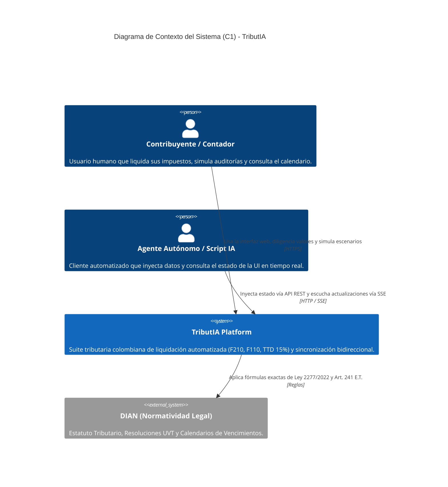
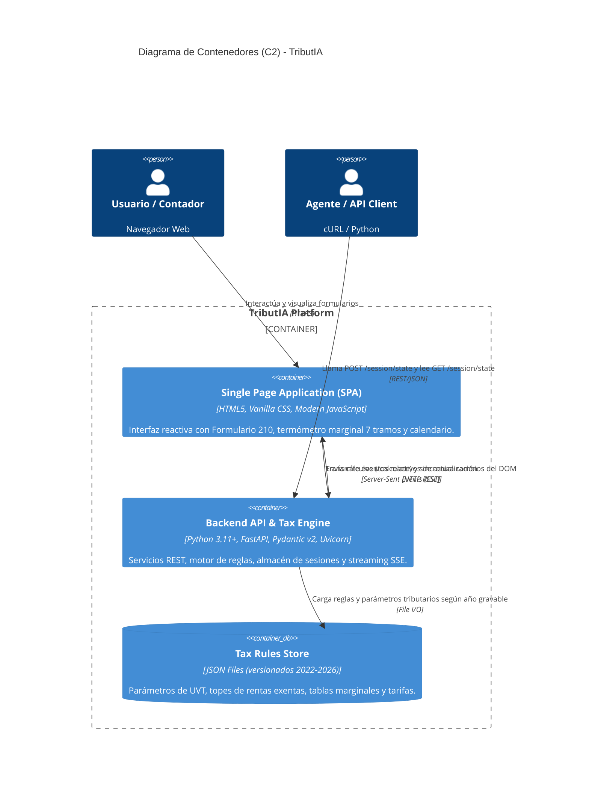
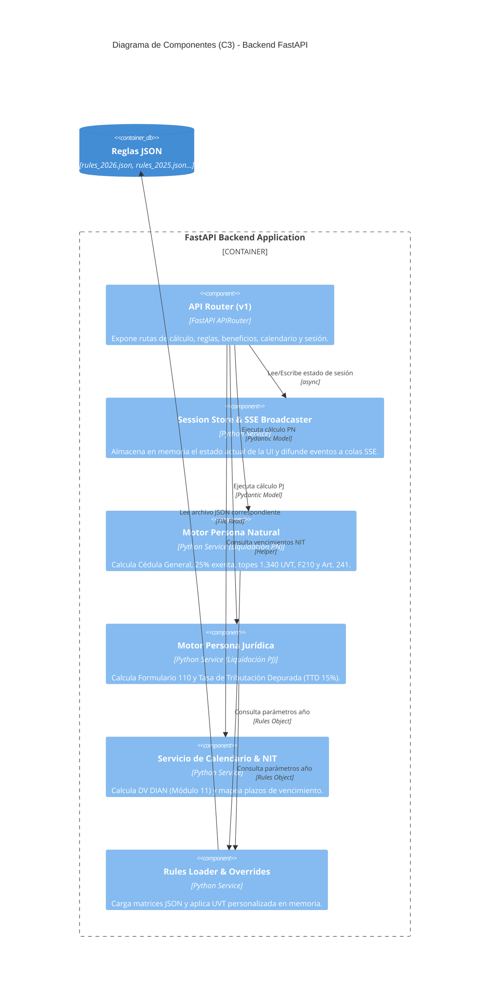

# 🏛️ Arquitectura C4 — TributIA

Este documento define la estructura y diseño arquitectónico de **TributIA** usando el modelo C4 de Simon Brown (Nivel 1: Contexto, Nivel 2: Contenedores, Nivel 3: Componentes).

---

## 1. Nivel 1: Diagrama de Contexto del Sistema (C1)

El diagrama de contexto muestra la interacción de TributIA con los diferentes usuarios, agentes externos y normatividad legal de la DIAN.

---

## 2. Nivel 2: Diagrama de Contenedores (C2)

Muestra los bloques ejecutables y tecnologías que conforman la solución.

---

## 3. Nivel 3: Diagrama de Componentes del Backend (C3)

Desglose interno de los módulos del backend FastAPI.

