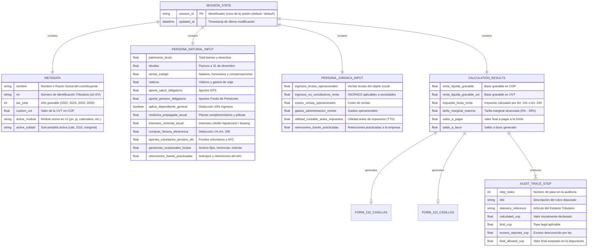

# 🗄️ Modelo de Entidades y Estado de Sesión

Este diagrama ERD describe la estructura lógica de los datos manipulados por la plataforma TributIA y sincronizados bidireccionalmente entre el servidor y el cliente.

