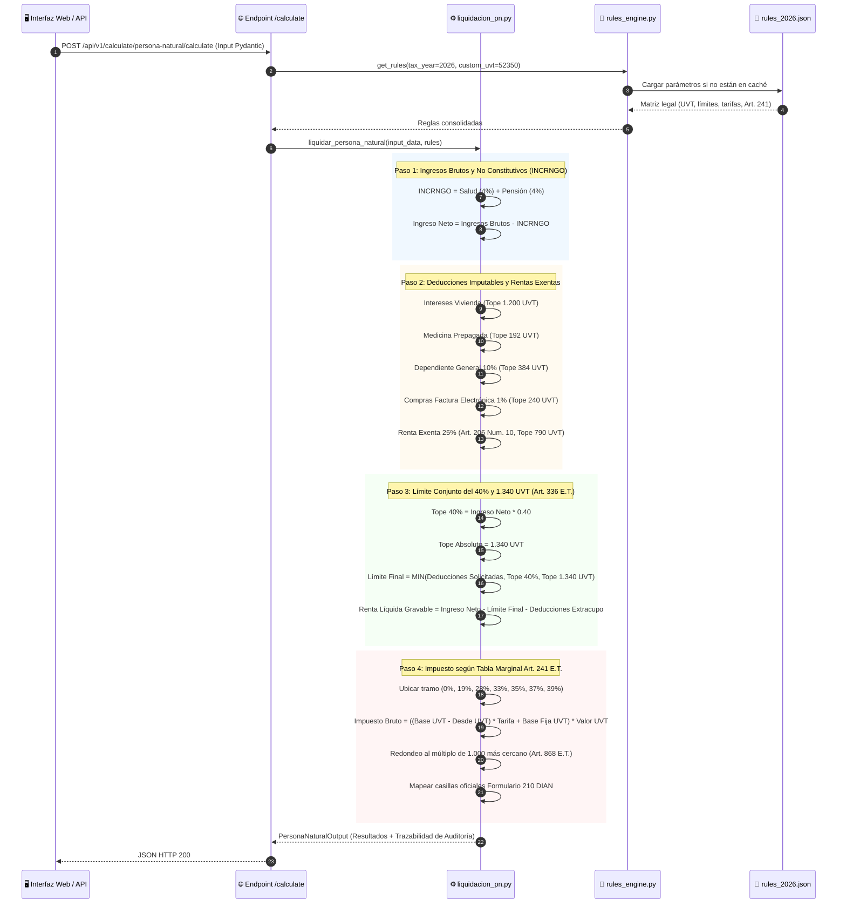

# 📊 Diagrama de Secuencia: Pipeline de Liquidación Tributaria

Este diagrama ilustra el flujo de ejecución interno para liquidar la Cédula General y el Formulario 210 según el Estatuto Tributario y la Ley 2277 de 2022.

