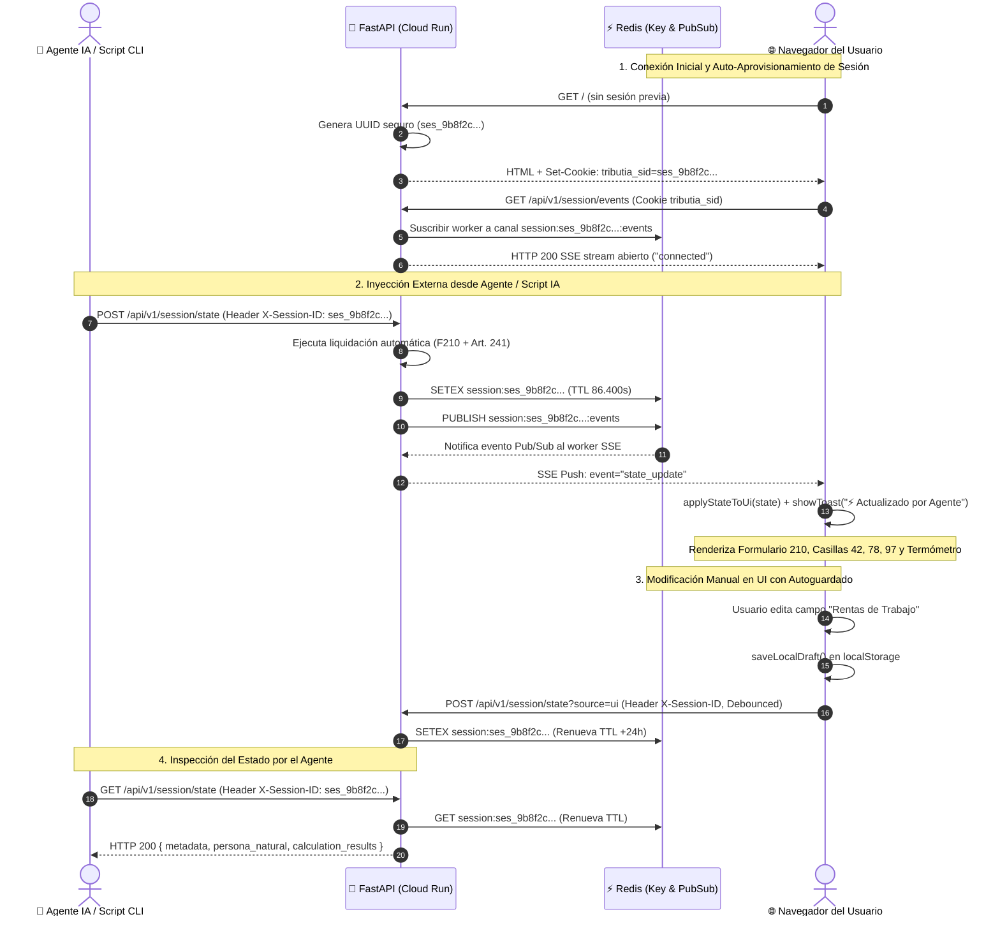

# Diagrama de Secuencia: Sincronización Bidireccional API ↔ UI en Redis

Este diagrama documenta la interacción reactiva y aislada entre un cliente externo (ej. Agente IA o script cURL con `X-Session-ID`), el Backend FastAPI en Cloud Run, Redis y el Navegador del usuario conectado vía Server-Sent Events (SSE).

