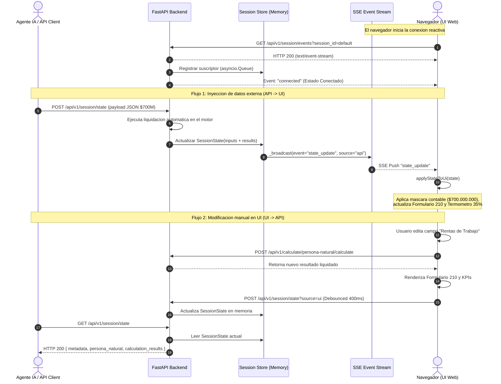

# Diagrama de Secuencia: Sincronizacion Bidireccional API <-> UI

Este diagrama documenta la interaccion reactiva entre un cliente externo (ej. Agente IA o script cURL), el Backend FastAPI y el Navegador del usuario conectado via Server-Sent Events (SSE).

