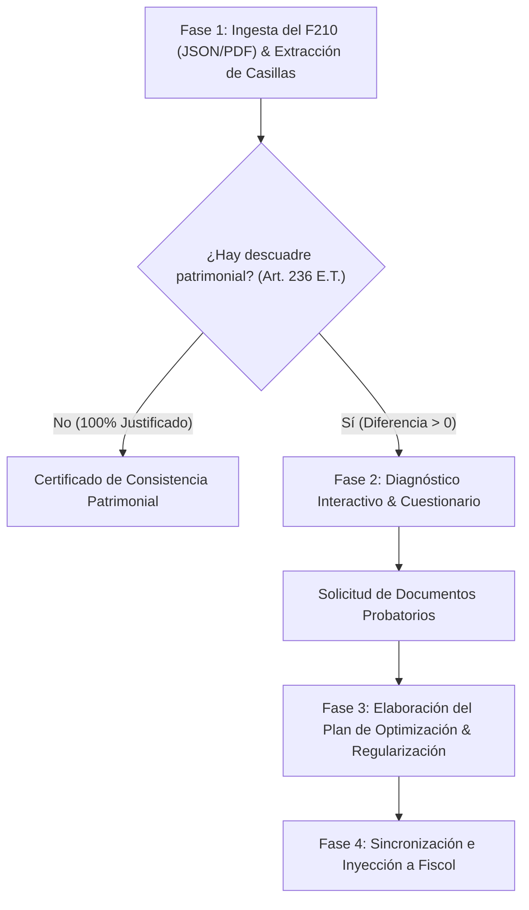

# Auditoría y Control por Comparación Patrimonial (Arts. 236 y 237 E.T.)

## Overview

Este skill guía a los agentes de IA (Google Antigravity, Claude Code, Cursor, Windsurf, Codex, etc.) para auditar declaraciones de renta de Personas Naturales en Colombia (**Formulario 210**), cotejar el incremento de patrimonio líquido frente a los ingresos y recursos percibidos, identificar riesgos por **Renta por Comparación Patrimonial (Art. 236 E.T.)**, guiar al contribuyente mediante un cuestionario diagnóstico estructurado solicitando soportes documentales precisos, y elaborar un **Plan de Regularización y Optimización Tributaria** para blindar la declaración ante la DIAN y prevenir sanciones de inexactitud del 100% (Art. 648 E.T.).

---

## When to Use

Use este skill cuando:
- El usuario cuente con un borrador o declaración del Formulario 210 y desee verificar si cumple el control de comparación patrimonial.
- Se haya adquirido un activo (inmueble, vehículo, inversiones) durante el año y se requiera auditar si los ingresos declarados y los pasivos son suficientes para justificarlo.
- Exista una diferencia entre el aumento de patrimonio líquido y las rentas líquidas obtenidas.
- Se requiera orientar al contribuyente sobre qué soportes probatorios recopilar (escrituras, créditos con fecha cierta, certificados de cesantías, desahorro de CDTs, o reajustes Art. 73 E.T.).
- Se necesite estructurar un plan de regularización con inyección en la plataforma Fiscol.

**NO usar para:**
- Declaraciones de Personas Jurídicas (Formulario 110).
- Liquidaciones ordinarias de IVA (Formulario 300) o Retención en la fuente (Formulario 350).

---

## Estructura Oficial de Casillas DIAN (Formulario 210)

> [!IMPORTANT]
> **Regla Crítica de Casillas DIAN:**
> 1. En el Formulario 210 **NO existe una casilla para el patrimonio del año anterior** en el formulario del año corriente. La DIAN obtiene el patrimonio anterior directamente de la **Casilla 31 de la declaración presentada el año gravable previo**.
> 2. **Casilla 28:** Corresponde a la **Deducción por compras soportadas con Factura Electrónica (1% Art. 336 Num. 5 E.T.)** (ubicada en la cabecera/sección informativa y suma a la Casilla 90).
> 3. **Casilla 29:** Total Patrimonio Bruto.
> 4. **Casilla 30:** Total Deudas y Pasivos.
> 5. **Casilla 31:** Total Patrimonio Líquido ($29 - 30$).
> 6. **Casilla 38:** Total Rentas Exentas y Deducciones Imputables Limitadas de Trabajo ($36 + 37$, topadas al 40% o 1.340 UVT).
> 7. **Casilla 40:** Deducciones Imputables No Sujetas al Límite (72 UVT por dependientes adicionales).
> 8. **Casilla 42:** Total Exentas y Deducciones de Trabajo ($38 + 41$).
> 9. **Casilla 89:** Total Ingresos Netos de la Cédula General.
> 10. **Casilla 90:** Total Rentas Exentas y Deducciones de la Cédula General (incluye $42 + 28$).
> 11. **Casilla 94:** Total Renta Líquida Ordinaria de la Cédula General ($89 - 90$).
> 12. **Casilla 125:** Total Impuesto Sobre la Renta a Cargo.
> 13. **Casilla 133 / 135:** Retenciones en la Fuente a título de renta.
> 14. **Casilla 137:** Saldo a Favor.

---

## Workflow en 4 Fases



---

### Fase 1: Ingesta del Borrador F210 & Diagnóstico Matemático

1. **Lectura y Normalización de Casillas:**
   ```bash
   # Opción A: Desde archivo JSON
   poetry run python skills/control-comparacion-patrimonial/scripts/analizar_comparacion.py borrador_f210.json --out diagnostico_patrimonial.json

   # Opción B: Extrayendo casillas desde PDF o con patrimonio anterior explícito
   poetry run python skills/control-comparacion-patrimonial/scripts/extraer_f210_borrador.py Renta2024.json --pl-anterior 15604000 --out datos_normalizados.json
   ```

2. **Evaluación de la Regla de Oro (Art. 236 E.T.):**
   $$\text{Incremento a Justificar} = \text{Patrimonio Líquido Actual (C31)} - \text{Patrimonio Líquido Anterior (C31 año anterior)} - \text{Ajustes Art. 73}$$
   $$\text{Capacidad Neta} = \text{Ingresos Netos (C89)} + \text{Nuevas Deudas Desembolsadas (C30)} - \text{Impuesto a Cargo (C125)} - \text{Consumo}$$

   *(Nota: La Casilla 89 equivale a la Renta Líquida Ordinaria C94 + Total Rentas Exentas y Deducciones C90, las cuales son ingresos reales percibidos que justifican capacidad patrimonial).*

   - Si $\text{Capacidad Neta} \ge \text{Incremento a Justificar}$: **Patrimonio 100% Justificado**.
   - Si $\text{Incremento a Justificar} > \text{Capacidad Neta}$: Se activa inmediatamente la **Fase 2**.

---

### Fase 2: Diagnóstico Interactivo & Cuestionario Guiado al Contribuyente

El agente debe interrogar al contribuyente sobre las 5 fuentes probatorias aceptadas por la DIAN:

1. **Adquisiciones en Copropiedad (Art. 8 E.T.):**
   - *Pregunta:* "¿El inmueble o vehículo adquirido fue comprado en copropiedad con su cónyuge o pareja (ej. 50/50) y se incluyó por error el 100% del valor patrimonial?"
   - *Documentos:* Escritura pública de compraventa y certificado de tradición y libertad.
2. **Nuevas Deudas y Pasivos con Soporte (Art. 283 E.T.):**
   - *Pregunta:* "¿Adquirió créditos bancarios o préstamos personales que no se hayan reflejado en la Casilla 30?"
   - *Documentos:* Certificado bancario a 31 de diciembre o **contrato de mutuo con FECHA CIERTA ante notaría** (Art. 283 E.T.).
3. **Cesantías Acumuladas de Años Anteriores:**
   - *Pregunta:* "¿Retiró cesantías acumuladas de su fondo para la compra de vivienda o abono a crédito hipotecario?"
   - *Documentos:* Certificado de desembolso del fondo de cesantías con fecha y monto.
4. **Desahorro de Cuentas o CDTs Declarados en Años Previos:**
   - *Pregunta:* "¿Utilizó dineros que ya venían declarados a 31 de diciembre del año anterior en cuentas bancarias o CDTs?"
   - *Documentos:* Extractos bancarios a 31 de diciembre del año anterior y constancia de liquidación.
5. **Reajustes Fiscales Oficiales (Art. 73 E.T.):**
   - *Pregunta:* "¿El incremento patrimonial proviene del reajuste fiscal DANE sobre activos poseídos de años anteriores?"
   - *Documentos:* Cédula de cálculo del costo ajustado por Art. 73 E.T.

---

### Fase 3: Elaboración del Plan de Regularización & Optimización

```bash
poetry run python skills/control-comparacion-patrimonial/scripts/generar_plan_optimizacion.py diagnostico_patrimonial.json --answers respuestas_usuario.json --out-md plan_optimizacion_patrimonial.md
```

El plan estructura:
1. **Ruta 1 (Incorporación de Soportes Válidos):** Acreditación de cesantías, inclusión de pasivos del Art. 283 y desahorro.
2. **Ruta 2 (Estructuración Conyugal):** Distribución en proindiviso 50/50 según titularidad jurídica real (Art. 8 E.T.).
3. **Ruta 3 (Subsanación Transparente):** Si no hay soportes suficientes, liquidar la Renta por Comparación Patrimonial para evitar la sanción por inexactitud del 100% (Art. 648 E.T.).
4. **Ruta 4 (Beneficio de Auditoría - Art. 689-3 E.T.):** Incrementar el impuesto neto en $\ge 35\%$ para firmeza en 6 meses y cerrar la ventana de auditoría de 3 años (Art. 714 E.T.).

---

### Fase 4: Sincronización e Inyección a la Plataforma Fiscol

```bash
poetry run python skills/control-comparacion-patrimonial/scripts/inyectar_session_patrimonial.py datos_regularizados.json --api-url https://fiscol-31954329640.us-central1.run.app --session-id default
```
