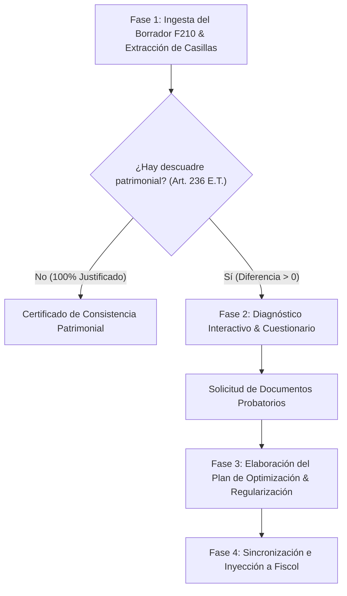

# Auditoría y Control por Comparación Patrimonial (Arts. 236 y 237 E.T.)

## Overview

Este skill guía a los agentes de IA (Google Antigravity, Claude Code, Cursor, Windsurf, Codex, etc.) para auditar borradores de declaraciones de renta de Personas Naturales en Colombia (**Formulario 210**), identificar discrepancias y riesgos por **Renta por Comparación Patrimonial (Art. 236 E.T.)**, guiar al contribuyente mediante un cuestionario diagnóstico estructurado solicitando soportes documentales precisos, y elaborar un **Plan de Regularización y Optimización Tributaria** para blindar la declaración ante requerimientos y sanciones de inexactitud del 100% de la DIAN (Art. 648 E.T.).

---

## When to Use

Use este skill cuando:
- El usuario cuente con un borrador de su Formulario 210 o datos patrimoniales del año actual frente al año anterior y desee verificar si cumple el control de comparación patrimonial.
- Se haya adquirido un activo (inmueble, carro, acciones) durante el año y se requiera auditar si los ingresos declarados son suficientes para justificarlo.
- Exista una diferencia no justificada entre el aumento de patrimonio líquido y las rentas líquidas obtenidas.
- Se requiera orientar al contribuyente sobre qué soportes probatorios recopilar (escrituras, créditos con fecha cierta, certificados de cesantías, desahorro de CDTs, o reajustes Art. 73 E.T.).
- Se necesite estructurar un plan de defensa y optimización tributaria con inyección en la plataforma Fiscol.

**NO usar para:**
- Declaraciones de Personas Jurídicas (Formulario 110).
- Liquidaciones ordinarias de IVA (Formulario 300) o Retención en la fuente (Formulario 350).

---

## Workflow en 4 Fases



---

### Fase 1: Ingesta del Borrador F210 & Diagnóstico Matemático

1. **Lectura y Normalización de Casillas del Formulario 210:**
   El agente extrae las casillas patrimoniales y cedulares clave del archivo o texto proporcionado por el usuario:
   - **Casilla 29:** Patrimonio Bruto Año Actual
   - **Casilla 30:** Deudas Año Actual
   - **Casilla 31:** Patrimonio Líquido Año Actual ($29 - 30$)
   - **Casilla 32:** Patrimonio Líquido Año Anterior
   - **Casilla 64 / 94:** Renta Líquida Ordinaria de la Cédula General
   - **Casillas 92 y 93:** Rentas Exentas y Deducciones Imputables
   - **Casilla 104:** Ganancias Ocasionales Netas
   - **Casilla 133 / 135:** Impuesto a Cargo y Retenciones en la Fuente

2. **Ejecución del CLI de Comparación:**
   ```bash
   poetry run python skills/control-comparacion-patrimonial/scripts/analizar_comparacion.py borrador_f210.json --out diagnostico_patrimonial.json
   ```

3. **Evaluación de la Regla de Oro (Art. 236 E.T.):**
   $$\text{Incremento a Justificar} = (\text{PL Actual} - \text{PL Anterior}) - \text{Ajustes sin Efectivo}$$
   $$\text{Capacidad Neta} = \text{Rentas Líquidas} + \text{Exentas} + \text{INCRNGO} + \text{Nuevos Pasivos} + \text{Desahorro} - \text{Impuestos} - \text{Consumo}$$

   - Si $\text{Diferencia No Justificada} = 0$: Se emite el dictamen de **Patrimonio Justificado**.
   - Si $\text{Diferencia No Justificada} > 0$: Se activa inmediatamente la **Fase 2**.

---

### Fase 2: Diagnóstico Interactivo & Cuestionario Guiado al Contribuyente

El agente debe presentar las 5 líneas de investigación probatoria al usuario y solicitar los documentos correspondientes:

1. **Adquisiciones de Inmuebles o Vehículos:**
   - *Pregunta:* "¿Compró o escrituró inmuebles o vehículos este año? ¿Cuál fue el costo real y si fue en copropiedad con su cónyuge?"
   - *Documentos:* Copia de la escritura pública registrada, certificado de tradición y libertad, matrícula vehicular.
2. **Nuevas Deudas y Pasivos (Art. 283 E.T.):**
   - *Pregunta:* "¿Adquirió créditos bancarios, hipotecarios o préstamos personales para financiar la compra?"
   - *Documentos:* Certificado bancario de deuda a 31 de diciembre o **contrato de mutuo con FECHA CIERTA ante notaría** (Art. 283 E.T.).
3. **Desahorro de Recursos Declarados Previamente:**
   - *Pregunta:* "¿Utilizó dineros que ya venían declarados a 31 de diciembre del año anterior en cuentas bancarias, o liquidó CDTs / fondos de inversión?"
   - *Documentos:* Extractos bancarios a 31 de diciembre del año anterior, constancias de cancelación de CDTs.
4. **Cesantías Acumuladas & Recursos Extraordinarios:**
   - *Pregunta:* "¿Retiró cesantías acumuladas de años previos con destino a vivienda, o recibió herencias / donaciones / indemnizaciones de seguro de vida (Art. 303-1 E.T.)?"
   - *Documentos:* Certificado de retiro de cesantías, escritura de sucesión o certificado de póliza.
5. **Reajustes Fiscales Oficiales (Art. 73 E.T.):**
   - *Pregunta:* "¿El incremento de su patrimonio bruto se debe al reajuste fiscal DANE sobre activos poseídos de años anteriores?"
   - *Documentos:* Cédula de cálculo del costo ajustado por Art. 73 E.T.

---

### Fase 3: Elaboración del Plan de Regularización & Optimización

Con las respuestas y soportes recopilados, el agente ejecuta el generador del plan:

```bash
poetry run python skills/control-comparacion-patrimonial/scripts/generar_plan_optimizacion.py diagnostico_patrimonial.json --answers respuestas_usuario.json --out-md plan_optimizacion_patrimonial.md
```

El plan estructura:
1. **Ruta 1 (Incorporación de Soportes Válidos):** Inclusión de deudas no registradas en Casilla 30, acreditación de desahorro y aplicación del Art. 73 E.T.
2. **Ruta 2 (Estructuración Conyugal):** División en proindiviso 50/50 o mutuo con fecha cierta (Art. 8 y 283 E.T.).
3. **Ruta 3 (Subsanación Transparente):** Si no hay soportes suficientes, liquidar la Renta por Comparación Patrimonial en el Formulario 210 para evitar la sanción por inexactitud del 100% de la DIAN (Art. 648 E.T.).
4. **Ruta 4 (Beneficio de Auditoría - Art. 689-3 E.T.):** Incrementar el impuesto neto en $\ge 35\%$ para obtener **firmeza en 6 meses** y cerrar el término de fiscalización de 3 años (Art. 714 E.T.).

---

### Fase 4: Sincronización e Inyección a la Plataforma Fiscol

Para actualizar el borrador en la interfaz web de Fiscol:

```bash
poetry run python skills/control-comparacion-patrimonial/scripts/inyectar_session_patrimonial.py datos_regularizados.json --api-url http://localhost:8000 --session-id default
```
